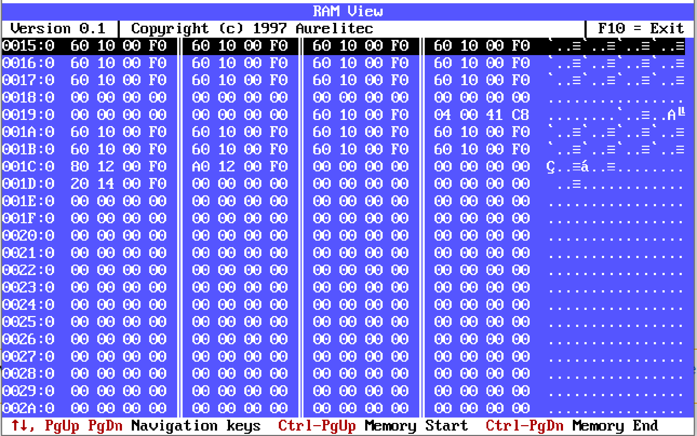

# RAM View
RAM View is a simple memory viewer with a text-based interface. It was originally written in 1997 using Borland C++ 3.1 and was designed to run on DOS systems.

RAM View was recently recompiled for educational and nostalgic reasons. With the DOSBox emulator, it can now be run on modern computers.

While the original software lacks search and navigation functionality, it serves as a reminder of the early days of computing and the challenges that developers faced in working with limited resources.

## Running

Here are some ways to run RAM View:

### Using DOSBox

Download and install [DOSBox](https://www.dosbox.com/), and read the [setup instructions](https://www.dosbox.com/wiki/Basic_Setup_and_Installation_of_DosBox). You can run RAM View using DOSBox on Windows (including **Windows 10**), macOS, Linux, Android, and more.

### Windows 7 (32-bit)

You can run RAM View directly on a computer running Windows 7, or in a Windows 7 virtual machine.

## To Do:

* Let the user search the memory for a text or an array of bytes
* Add a feature to allow the user to go the given address
* Display an information panel about memory configuration and size

## Contributing
[Pull requests](https://github.com/aurelitec/ramview/pulls) are welcome. For major changes, please open an [issue](https://github.com/aurelitec/ramview/issues) first to discuss what you would like to change.

### Learn from Sergey's experience - Contributing to RAM View

RAM View has recently been the subject of an [informative tutorial](https://habr.com/ru/company/timeweb/blog/697688/) published by Sergey, aka dlinyj, who writes for Hacker, a widely acclaimed publication for IT enthusiasts. In his tutorial, Sergey writes about how he edited and helped improve our small legacy RAM View utility by building it from source code with an old compiler, fixing errors caused by encoding problems, and sending a pull request to the original repository to add his changes. This is a reminder that even small projects like RAM View can be the subject of interesting and informative tutorials that offer insights into the world of programming.

Read more on our website:  
[Don't Underestimate Small Projects: An Informative Tutorial on Editing RAM View's Code](https://www.aurelitec.com/reviews/dont-underestimate-small-projects-ramview-code/)

## License

Copyright (c) Aurelitec. All rights reserved.

Licensed under the [MIT](LICENSE) license.
